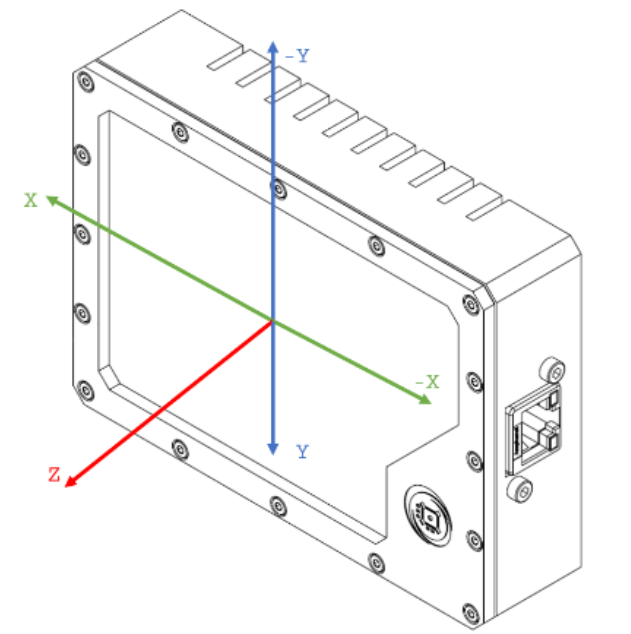
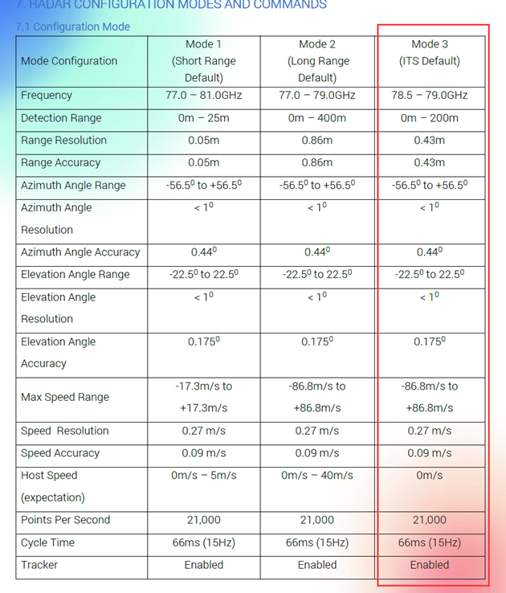
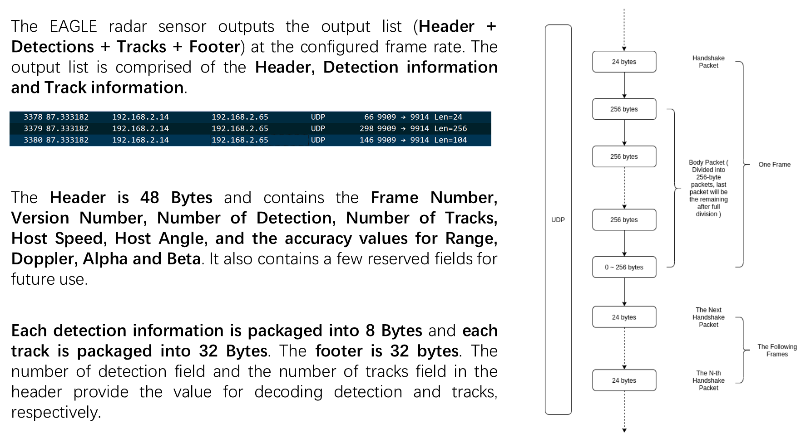
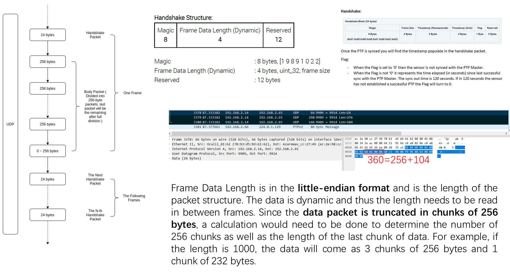
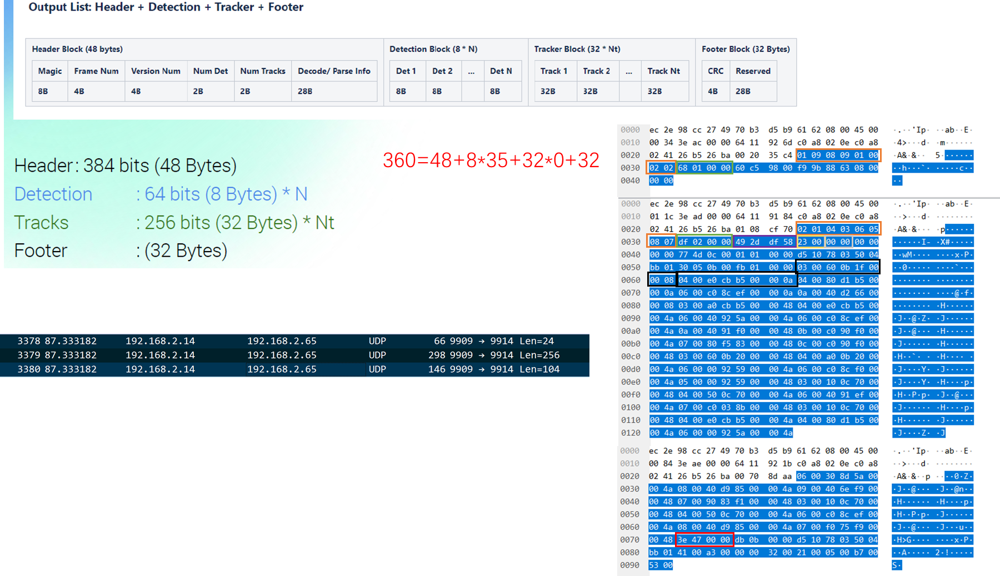
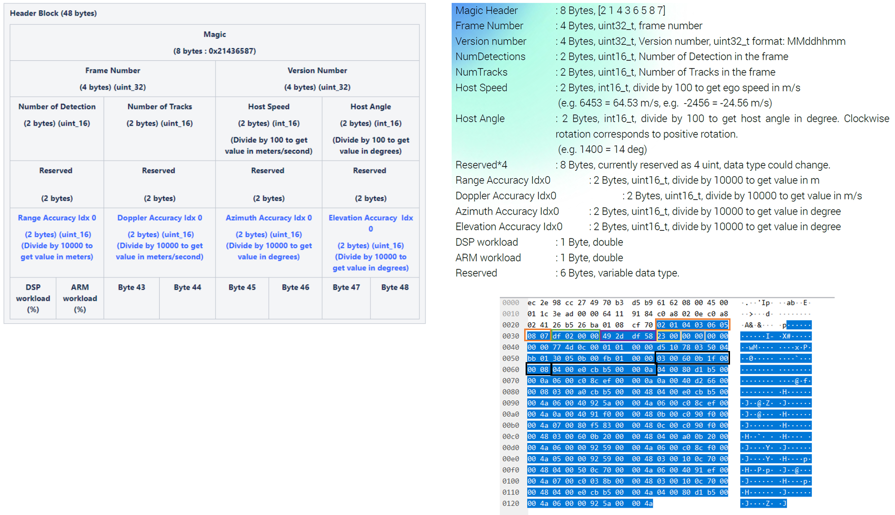
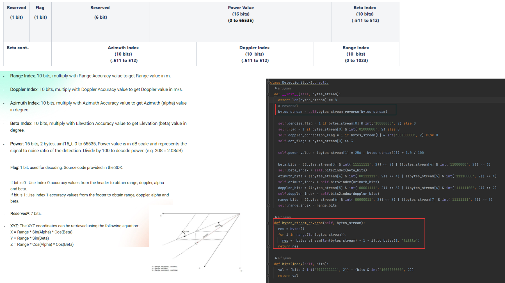
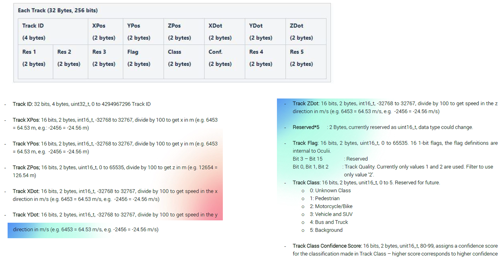
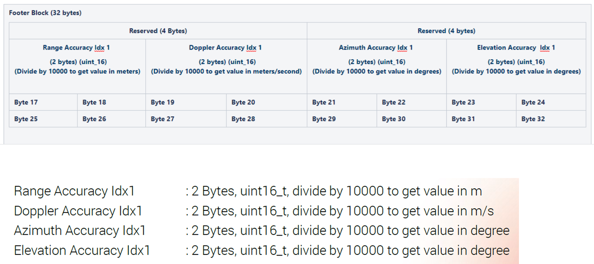

# OCULii EAGLE mmwave radar network packets decode

## functions

1. when ptp sync function is running, generate pointcloud(.pcd/.npz) according to network packets, and name a pointcloud frame as timestamp_unix
2. decode PTP timestamp
3. decode pointcloud

## introduction

## Handshake Packet

## Body Packet

### Header Block

### Detection Block

### Tracker Block

### Footer Block

